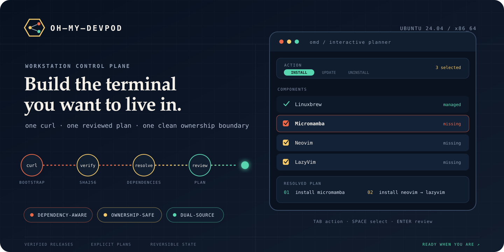

<p align="center">
  
</p>

<p align="center">
  <a href="https://github.com/zhangdw156/oh-my-devpod/releases"></a>
  
  
  
  <a href="./LICENSE"></a>
</p>

<p align="center">
  <strong>English</strong> · <a href="./Readme.osc.md">简体中文</a>
</p>

<p align="center">
  <strong>Turn a fresh Ubuntu machine into a deliberate development environment.</strong><br />
  One verified bootstrap, one dependency-aware plan, and a clean boundary between your tools and ours.
</p>

<p align="center">
  <a href="#quick-start"><strong>Install</strong></a>
  ·
  <a href="#component-catalog"><strong>Explore components</strong></a>
  ·
  <a href="#how-the-tui-works"><strong>See the workflow</strong></a>
  ·
  <a href="#safety-by-construction"><strong>Review safety</strong></a>
</p>

---

## Why oh-my-devpod?

| Plan before changing | Respect what already exists | Choose the closest source |
| --- | --- | --- |
| Select tools, inspect the resolved dependency plan, then execute it. | Existing installations remain external: `omd` does not claim or remove them. | GitHub uses upstream sources; Gitee activates USTC Homebrew and TUNA Python mirrors. |

oh-my-devpod is a focused productivity-tool manager for **Ubuntu 24.04 x86_64**.
It combines a Rust + Ratatui interface with small shell lifecycle modules, so the
interactive experience stays fast while every install, update, and uninstall
remains explicit and inspectable.

## Quick start

### npm

Use the upstream source profile:

```bash
npm install --global oh-my-devpod
```

Or select the China mirror profile during installation:

```bash
OHMYDEVPOD_SOURCE=gitee npm install --global oh-my-devpod
```

Both commands install the `omd` executable. The npm package currently supports
Ubuntu 24.04 x86_64 only.

### GitHub · upstream sources

```bash
curl -fsSL https://raw.githubusercontent.com/zhangdw156/oh-my-devpod/main/install/bootstrap.sh | bash
```

### Gitee · China mirrors

```bash
curl -fsSL https://gitee.com/zhangdw156/oh-my-devpod/raw/main/install/bootstrap.sh \
  | OHMYDEVPOD_SOURCE=gitee bash
```

The bootstrap downloads the complete release bundle, verifies its SHA256
checksum, installs it under your user account, and opens the TUI. After
installation:

```bash
omd
```

> [!NOTE]
> The default binary is `~/.local/bin/omd`. Restart your shell if that directory
> was not already on `PATH`.

## Component catalog

Every component is selectable on its own. Runtime dependencies and
install-time providers are resolved automatically.

| Category | Components | What they cover |
| --- | --- | --- |
| Foundation | **Linuxbrew**, **Zsh**, **uv**, **Micromamba** | User-space packages, shell, and Python/environment tooling |
| Development | **Git** | Version control |
| Terminal | **ripgrep**, **fzf**, **bat**, **fd**, **jq**, **Atuin**, **Zellij**, **Yazi**, **btop** | Search, navigation, history, sessions, files, and system visibility |
| Editor | **Neovim**, **LazyVim** | Terminal editing and a managed editor configuration |
| Configuration | **Zsh productivity configuration** | Oh My Zsh, Powerlevel10k, completions, history, and fuzzy search |

For example, this plan adds Micromamba and LazyVim while automatically placing
their providers first:

```bash
omd --plan install micromamba lazyvim
```

```text
requested tools
      │
      ▼
components.toml ── resolve dependencies ── review ordered plan ── execute modules
```

If Git, Neovim, or another dependency is already installed outside
oh-my-devpod, it satisfies the dependency without being adopted.

## How the TUI works

The interface keeps discovery and mutation separate:

1. **Choose an action** — install, update, or uninstall.
2. **Select components** — states are shown as missing, managed, broken, or external.
3. **Review the plan** — dependencies are ordered before installation; dependants are ordered before removal.
4. **Execute explicitly** — the reviewed plan is revalidated before any module runs.

| Key | Action |
| --- | --- |
| `Tab` | Cycle install / update / uninstall |
| `↑` / `↓` or `j` / `k` | Move through components |
| `Space` | Toggle selection |
| `Enter` | Review, then execute |
| `Esc` | Go back or exit |
| `q` | Quit |

## CLI control

Use the TUI for guided operation or the CLI for inspection and automation.

```bash
# Inventory and metadata
omd --list-components
omd --status
omd --version

# Plan without changing the machine
omd --plan install micromamba lazyvim
omd --plan-current uninstall lazyvim neovim
omd --dry-run

# Execute against the current machine state
omd --execute install ripgrep fzf
```

### Self-update and source switching

```bash
omd --update           # update from the saved source
omd --update --github  # update and switch managed sources upstream
omd --update --gitee   # update and switch to China mirrors
```

| Command | Persistent effect |
| --- | --- |
| `omd --update` | Uses `~/.config/oh-my-devpod/source`; invalid or missing configuration falls back to GitHub. |
| `omd --update --github` | Uses GitHub releases and switches managed Homebrew, Micromamba, uv, and pip sources to upstream. |
| `omd --update --gitee` | Uses Gitee releases and switches managed sources to USTC Homebrew plus TUNA Micromamba, uv, and pip mirrors. |

`--github` and `--gitee` are mutually exclusive. A source switch is applied
even when the installed version is already current. Self-update replaces only a
SHA256-verified release bundle—it does not open the TUI or update installed
components. Failed downloads, validation, or activation preserve the active
version and previous source profile.

For npm-managed installations, update through npm instead:

```bash
npm update --global oh-my-devpod
```

`omd --update` is intentionally rejected for npm-managed installations so npm
remains the single owner of the installed package. npm updates retain the saved
source profile; pass `OHMYDEVPOD_SOURCE=github|gitee` only when changing it.

Source changes apply immediately to OMD-launched component operations. Start a
new managed shell, or re-source
`${OHMYDEVPOD_CONFIG_DIR:-${XDG_CONFIG_HOME:-$HOME/.config}/oh-my-devpod}/env`,
to refresh an interactive shell that was already running.

Managed Zsh initializes the Mamba shell hook without overriding
`MAMBA_ROOT_PREFIX`; Homebrew-installed Mamba keeps its versioned Cellar root.
After upgrading an existing installation from 0.14.1 or earlier, run
`omd --execute update zsh-config` and start a new shell once.

## Architecture

```text
GitHub / Gitee
      │  versioned archive + SHA256
      ▼
install/bootstrap.sh
      │  activates ~/.local/bin/omd
      ▼
┌──────────────────────── Rust ────────────────────────┐
│  Ratatui interface → catalog → dependency planner   │
│                              → lifecycle runner      │
└──────────────────────────┬───────────────────────────┘
                           │ status / managed / install
                           │ update / uninstall
                           ▼
┌──────────────────────── Shell ───────────────────────┐
│  component modules → tools, config, ownership marks │
└──────────────────────────────────────────────────────┘
```

| Path | Responsibility |
| --- | --- |
| `components.toml` | Single source of truth for components and dependencies |
| `install/bootstrap.sh` | Dual-source, checksum-verified installation |
| `install/update.sh` | Transactional self-update and source switching |
| `crates/omd/` | Rust TUI, catalog validation, planning, and execution |
| `modules/core/`, `modules/tools/` | Component lifecycle implementations |
| `modules/lib/` | Shared ownership and safety primitives |
| `npm/` | npm launcher, install-source selection, and package metadata |
| `build/`, `vendor/`, `config/` | Release assembly and pinned assets |
| `VERSION` | Release version source of truth |

## Safety by construction

- **Ownership-gated removal** — only artifacts carrying an oh-my-devpod marker
  can be removed.
- **External means external** — pre-existing tools are detected but never
  adopted or deleted.
- **Dependency-safe plans** — uninstall is blocked while an installed dependant
  would be broken.
- **Protected foundation** — Linuxbrew is excluded from the normal uninstall flow.
- **Configuration preservation** — existing Zsh and Neovim configuration is
  backed up before takeover; user data, caches, and backups survive removal.
- **Verified releases** — archives must pass SHA256 and bundle validation before
  activation.
- **Transactional updates** — source configuration and managed Homebrew remotes
  roll back if self-update cannot complete.

Managed state lives under:

```text
~/.local/bin/omd
~/.local/share/oh-my-devpod/releases/<version>/
~/.local/share/oh-my-devpod/opt/
~/.local/state/oh-my-devpod/
~/.config/oh-my-devpod/
```

## Development

The catalog is declarative; each module implements the same
`status` / `managed` / `install` / `update` / `uninstall` contract.

```bash
bash tests/run.sh
cargo fmt --all -- --check
cargo test -p omd
cargo run -p omd -- --version
cargo run -p omd -- --list-components
cargo run -p omd -- --plan install micromamba lazyvim
git diff --check
```

Release bundles are built with:

```bash
bash build/package-omd.sh
bash build/package-npm.sh dist/omd-x86_64-unknown-linux-gnu.tar.gz
```

See [`DEVELOPMENT.md`](./DEVELOPMENT.md) for module boundaries, ownership rules,
mirror behavior, and release maintenance. npm release bootstrapping is
documented in [`docs/npm-release.md`](./docs/npm-release.md).

---

<p align="center">
  <sub>Built for deliberate terminals: fast to bootstrap, explicit to change, safe to undo.</sub>
</p>
